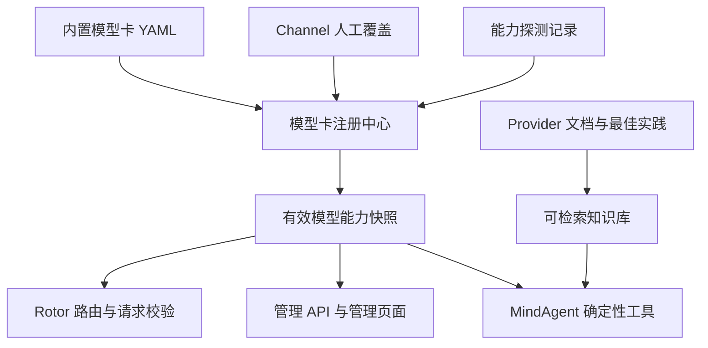

# 模型卡与模型能力知识库设计

## 1. 背景

Rotor 当前以 Channel 为主要路由对象，模型列表由 Channel 配置提供，部分能力通过
`Channel.extra.capabilities` 描述。这种方式适合早期协议兼容判断，但无法可靠表达：

- 同一 Channel 下不同模型具有不同能力。
- 同一模型在不同 Channel 上开放的接口和能力可能不同。
- “多模态”无法说明具体支持图片、视频、音频还是文件。
- 支持图片理解不代表支持 OCR、视觉定位或文档理解。
- 模型能力、限制和可用状态会随 Provider 发布而变化。
- MindAgent 需要可追溯的事实来源，不能仅根据模型名称猜测能力。

因此 Rotor 需要一个结构化模型卡注册中心，并在此基础上建立供 Rotor Agent 使用的
模型知识库。

## 2. 设计目标

### 2.1 核心目标

1. 用结构化数据描述模型的模态、任务、接口特性和限制。
2. 支持模型级能力与 Channel 级实际能力的合并。
3. 让路由在调用上游前完成确定性的能力匹配。
4. 让每个能力结论都具有来源、验证时间和可信度。
5. 为管理页面、管理 API 和 MindAgent 提供统一事实源。
6. 支持人工维护、自动探测和未来的外部模型目录同步。

### 2.2 非目标

第一阶段不追求：

- 自动抓取所有 Provider 文档并未经审核地写入生产目录。
- 仅通过模型名称或正则表达式推断能力。
- 用向量检索结果直接参与安全关键的路由决策。
- 对模型质量做绝对排名。
- 将“Provider 支持某种模态”等价为“该 Provider 的所有模型都支持”。

## 3. 关键概念

### 3.1 模态

模态描述模型直接接受或产生的数据类型：

- 输入：`text`、`image`、`audio`、`video`、`file`
- 输出：`text`、`image`、`audio`、`video`、`embedding`

例如 `image-text -> text` 表示模型可以接收图片和文本，输出文本。

### 3.2 任务能力

任务能力描述模型能对模态执行什么操作：

- `text_generation`
- `vision_understanding`
- `ocr`
- `document_understanding`
- `visual_grounding`
- `image_generation`
- `speech_to_text`
- `text_to_speech`
- `embedding`
- `reranking`

OCR 是任务能力，不是独立模态。模型可以支持图片输入和视觉问答，但 OCR 能力仍为
未知或不支持。

### 3.3 接口特性

接口特性描述调用方式，而不是模型本身的知识能力：

- `streaming`
- `function_calling`
- `parallel_tool_calls`
- `structured_output`
- `reasoning`
- `context_cache`
- `native_responses`
- `background_response`
- `previous_response_id`

### 3.4 支持状态

每项能力使用四态值，而不是简单布尔值：

| 状态 | 含义 |
|---|---|
| `supported` | 已确认支持 |
| `unsupported` | 已确认不支持 |
| `conditional` | 在特定协议、参数、地区或 Channel 下支持 |
| `unknown` | 缺少可靠证据 |

路由默认将 `unknown` 视为不满足强制要求，除非管理员明确允许试探性路由。

## 4. 总体架构



模型卡注册中心是确定性事实源。Provider 文档和向量检索用于补充解释，不直接替代
结构化能力判断。

## 5. 数据分层

### 5.1 内置模型卡

建议将人工审核过的基础数据提交到仓库：

```text
src/rotor/model_catalog/
  schema.py
  registry.py
  cards/
    zhipu.yaml
    moonshot.yaml
    minimax.yaml
    openai.yaml
```

优点：

- 能参与代码评审和版本发布。
- 变更可追踪、可回滚。
- 新安装的 Rotor 具有基础能力知识。
- 不依赖外部服务即可完成路由判断。

### 5.2 Channel 覆盖

Channel 覆盖用于表示代理渠道、地区、账号权限或自定义网关造成的能力差异。

建议新增数据库表：

```text
model_capability_overrides
  id
  channel_id
  model
  patch
  reason
  created_by
  created_at
  updated_at
```

### 5.3 能力探测

探测结果单独保存，不直接覆盖人工数据：

```text
model_capability_probes
  id
  channel_id
  model
  capability
  status
  request_summary
  response_summary
  error_code
  latency_ms
  billable
  probed_at
  expires_at
```

管理员审核后，可以将探测结果提升为 Channel 覆盖。

## 6. ModelCard Schema

建议的模型卡示例：

```yaml
schema_version: 1
id: kimi-k2.5
provider: moonshot
display_name: Kimi K2.5
aliases:
  - kimi-k2.5

family: kimi-k2
version: "2.5"
status: active

modalities:
  input:
    text: supported
    image: supported
    audio: unknown
    video: unknown
    file: conditional
  output:
    text: supported
    image: unsupported
    audio: unsupported
    video: unsupported
    embedding: unsupported

tasks:
  text_generation: supported
  vision_understanding: supported
  ocr: conditional
  document_understanding: unknown
  visual_grounding: unknown

features:
  streaming: supported
  function_calling: supported
  structured_output: unknown
  reasoning: supported
  native_responses: unsupported

protocols:
  openai_chat: supported
  openai_responses: conditional
  anthropic_messages: unknown

limits:
  context_tokens: null
  max_output_tokens: null
  max_images: null
  max_image_bytes: null
  image_mime_types: []

knowledge:
  cutoff: null
  languages: []

evidence:
  - evidence_id: moonshot-official-k2.5
    source_type: official_documentation
    url: https://platform.moonshot.ai/
    title: Kimi K2.5 documentation
    verified_at: 2026-07-28
    applies_to:
      - modalities.input.image
      - tasks.vision_understanding

updated_at: 2026-07-28
```

### 6.1 Pydantic 类型建议

核心类型：

```python
class SupportState(str, Enum):
    SUPPORTED = "supported"
    UNSUPPORTED = "unsupported"
    CONDITIONAL = "conditional"
    UNKNOWN = "unknown"


class CapabilityEvidence(BaseModel):
    evidence_id: str
    source_type: Literal[
        "official_documentation",
        "provider_api",
        "channel_probe",
        "manual_override",
        "community",
    ]
    url: str | None = None
    title: str
    verified_at: date
    applies_to: list[str]


class ModelCard(BaseModel):
    schema_version: int
    id: str
    provider: str
    aliases: list[str]
    modalities: ModelModalities
    tasks: dict[str, SupportState]
    features: dict[str, SupportState]
    protocols: dict[str, SupportState]
    limits: ModelLimits
    evidence: list[CapabilityEvidence]
```

对高频、路由关键字段使用强类型；对快速演进的任务和特性允许字典扩展，但必须经过
Schema 校验。

## 7. 有效能力合并

### 7.1 优先级

同一模型在某个 Channel 上的有效能力按以下优先级计算：

```text
Channel 人工覆盖
  > 已审核且未过期的 Channel 探测
  > 内置官方模型卡
  > 未审核探测或社区信息
  > unknown
```

### 7.2 合并规则

1. 覆盖以字段路径为单位，不替换整张模型卡。
2. `unsupported` 可以覆盖基础卡的 `supported`，用于表达代理渠道限制。
3. 自动探测不得静默覆盖人工配置。
4. 过期探测只作为历史证据，不参与默认路由。
5. 别名最终解析到规范模型 ID，但保留 Channel 的真实上游模型名。
6. 冲突能力必须进入管理页面的待审核列表。

### 7.3 缓存

注册中心可缓存有效模型卡：

```text
cache key = catalog_version + channel_id + requested_model + override_version
```

Channel 更新、模型卡更新或探测审核后使对应缓存失效。

## 8. 请求能力提取

Rotor 应从请求协议和内容生成结构化要求：

| 请求特征 | 能力要求 |
|---|---|
| 普通文本消息 | `input:text`、`output:text` |
| `image_url` 或图片内容块 | `input:image`、`output:text` |
| 音频输入块 | `input:audio` |
| 视频输入 | `input:video` |
| PDF/DOCX 文件 | `input:file` |
| 明确 OCR 任务 | `task:ocr` |
| Function tools | `feature:function_calling` |
| JSON Schema 输出 | `feature:structured_output` |
| Responses 状态操作 | `feature:native_responses` |
| 后台响应 | `feature:background_response` |

请求需求由协议 Adapter 标准化后交给路由引擎，不由各端点重复实现。

## 9. 路由集成

建议引入：

```python
requirements = capability_resolver.from_request(request, protocol)

decision = routing_engine.route(
    channels,
    model=request.model,
    required_capabilities=requirements,
)
```

候选对象由单纯的 Channel 升级为模型部署：

```python
@dataclass
class ModelDeployment:
    channel: Channel
    requested_model: str
    provider_model: str
    effective_card: EffectiveModelCard
```

过滤顺序：

1. Token 是否允许访问 Channel。
2. Channel 是否启用并提供该模型。
3. 协议是否兼容。
4. 模态、任务和接口特性是否满足。
5. 请求是否超过模型限制。
6. 在兼容候选中执行优先级、权重、亲和和 adaptive 排序。

没有匹配候选时返回不包含密钥的诊断：

```json
{
  "error": {
    "code": "model_capability_mismatch",
    "message": "No deployment supports the requested image input",
    "required": ["input:image", "output:text"],
    "candidates": [
      {
        "channel_id": 1,
        "model": "glm-5",
        "missing": ["input:image"]
      }
    ]
  }
}
```

## 10. 能力探测

### 10.1 探测类型

- 非计费探测：`GET /models`、读取 Provider 模型元数据。
- 低成本生成探测：流式、工具调用、结构化输出。
- 多模态探测：发送固定小图片并要求描述或 OCR。
- 协议探测：Responses 原生生命周期、Anthropic 原生事件。

### 10.2 安全要求

- 生成类探测必须明确标记可能计费。
- 管理员触发，不允许普通 Rotor Token 调用。
- 固定使用内置、无敏感信息的探测素材。
- 保存请求摘要，不保存 Provider Key。
- 对 `base_url` 做 SSRF 防护。
- 设置超时、并发限制和每日探测预算。

### 10.3 探测不等于官方保证

一次成功只能证明当前 Channel 在当前时间接受了该请求。探测结果应包含有效期，
不能永久替代官方模型卡。

## 11. 管理 API

建议增加：

```text
GET    /api/admin/model-cards
GET    /api/admin/model-cards/{model}
PUT    /api/admin/model-cards/{model}/overrides/{channel_id}
DELETE /api/admin/model-cards/{model}/overrides/{channel_id}
POST   /api/admin/model-cards/{model}/probe
GET    /api/admin/model-cards/{model}/evidence
GET    /api/admin/model-cards/compare
POST   /api/admin/model-cards/recommend
```

供路由客户端读取的安全子集：

```text
GET /v1/models/{model}/capabilities
```

公开接口不应暴露内部 Channel 名称、探测错误正文或管理备注。

## 12. 管理页面

模型页面建议展示：

- 规范模型 ID、别名、Provider 和状态。
- 输入/输出模态。
- 任务和接口特性。
- 上下文、输出长度、图片格式等限制。
- 官方来源和最后验证时间。
- 不同 Channel 的覆盖差异。
- 探测结果、过期状态和冲突提醒。
- “为什么可以/不可以路由该请求”的诊断视图。

状态颜色必须区分 `unsupported` 与 `unknown`，不能都显示为简单的灰色否定。

## 13. MindAgent 集成

第一阶段为 MindAgent 注册确定性工具：

```text
get_model_card
list_models_by_capability
compare_models
recommend_model
explain_route
list_stale_model_cards
```

典型调用流程：

```text
用户：“哪个模型可以识别图片中的表格？”
  → 提取要求 input:image + task:ocr + output:text
  → 调用 list_models_by_capability
  → 根据当前可用 Channel、来源和限制生成答案
  → 附带模型选择依据和未知项
```

MindAgent 不得仅依赖语言模型记忆回答当前模型能力。

第二阶段再加入文档检索知识库，内容包括：

- Provider 官方接入文档。
- 模型发布说明和迁移指南。
- API 参数和协议差异。
- 图片、视频、文件格式限制。
- 计价、限流和区域可用性。
- Rotor 已知兼容性问题与最佳实践。

结构化模型卡拥有更高事实优先级；文档检索用于解释和补充。

## 14. 更新与治理

### 14.1 更新流程

1. 发现新模型或能力变化。
2. 收集官方来源。
3. 更新模型卡并运行 Schema 校验。
4. 执行可用的能力探测。
5. 生成变更差异。
6. 人工审核。
7. 合并发布并使缓存失效。

### 14.2 过期策略

- 模型卡保存 `updated_at` 和证据 `verified_at`。
- 超过指定时间未验证时标记为 `stale`，但不自动删除。
- Provider 宣布下线后标记 `deprecated` 或 `retired`。
- 模型别名变化必须保留迁移记录。

### 14.3 可观测性

记录：

- 请求提取出的能力要求。
- 候选模型部署及缺失能力。
- 最终使用的模型卡版本。
- Channel 覆盖版本。
- 能力探测成功率和过期数量。
- 因能力不匹配而拒绝或重新路由的请求数。

## 15. 分阶段实现

### 阶段 A：Schema 与内置目录

- 定义 `ModelCard`、证据和支持状态。
- 建立 YAML 加载、校验和别名解析。
- 覆盖当前已配置模型。
- 增加单元测试和目录一致性检查。

### 阶段 B：查询 API 与管理页面

- 实现模型卡列表、详情和能力筛选。
- 展示来源、验证时间和未知能力。
- 增加 Channel 覆盖。

### 阶段 C：路由能力匹配

- 从 Chat、Responses、Anthropic 和 Images 请求提取能力。
- 使用有效模型卡过滤候选。
- 返回结构化不兼容诊断。
- 将模型卡版本写入路由决策记录。

### 阶段 D：能力探测

- 实现非计费探测。
- 增加受控的生成、工具和图片探测。
- 保存结果、有效期和审核状态。

### 阶段 E：MindAgent 知识库

- 注册确定性模型卡工具。
- 实现模型比较、推荐和路由解释。
- 接入 Provider 文档检索。
- 对回答附加来源和不确定性说明。

## 16. 验收标准

- 所有内置模型卡均通过 Schema 校验。
- 当前启用 Channel 的每个模型都有模型卡或明确的 `unknown` 卡。
- 图片请求不会进入已知纯文本模型。
- OCR 请求只进入 `ocr=supported/conditional` 且条件满足的模型。
- Channel 覆盖能够限制基础模型卡声明的能力。
- 路由决策保存模型卡及覆盖版本。
- 能力不匹配错误能够说明缺失项。
- 管理页面能区分支持、不支持、条件支持和未知。
- MindAgent 的模型推荐结果来自结构化查询，并可返回证据来源。
- 探测接口具备鉴权、计费提醒、SSRF 防护和审计记录。

## 17. 待确认问题

- 内置目录是按 Provider 分文件，还是按模型家族分文件。
- 是否允许用户为私有模型创建完全独立的模型卡。
- `conditional` 条件采用结构化表达式还是第一阶段仅使用文字说明。
- 公共 `/v1/models` 是否返回能力扩展字段，还是新增独立端点。
- 模型价格与质量评测是否纳入同一模型卡，或拆分为独立的动态数据集。
- 自动同步外部模型目录时采用何种信任和审核策略。
