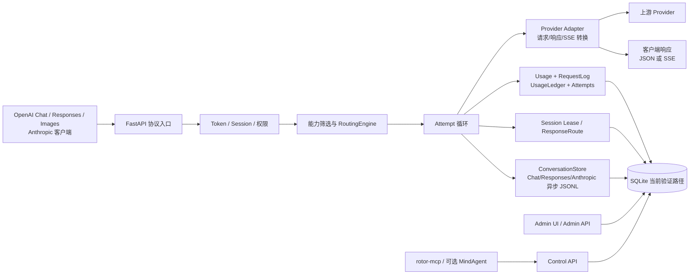
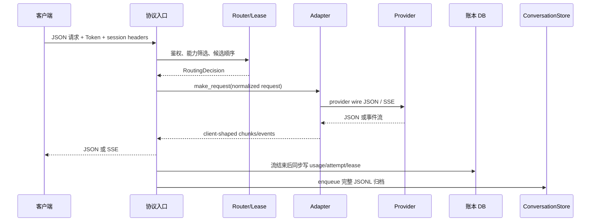

# Rotor 当前实现设计（权威快照）

> 本文是“代码事实”文档，不是路线图。它回答的是：在指定快照边界内，Rotor
> 实际启动什么、暴露什么、怎样选渠道、怎样转换协议、怎样记账，以及失败时会发生
> 什么。若本文与 README、GitBook 或提案冲突，以快照工作树中的代码为准；代码仍
> 是最终事实来源。

## 先看结论

Rotor 是一个单进程优先的 FastAPI LLM 网关：四个客户端协议入口共享
“Token 鉴权 → 会话解析 → 能力筛选 → 有序候选 → Provider Adapter → 记账”链路，
其中 Chat、Responses、Anthropic 还接入 ConversationStore 归档；Images 目前不写该归档。
**客户端协议**和 **Channel 的上游协议**是两层独立概念，因此
`POST /v1/chat/completions` 可以选择 `protocol=openai_responses` 的 Channel，向上游
发送 `/responses`，再把 Responses 事件转换回 Chat SSE；反向的 Responses→Chat/Anthropic
转换也存在，但只覆盖可表达的基础请求。

当前默认、也是启动迁移实际支持的数据库路径是文件 SQLite。配置、依赖和 Compose
虽然声称 PostgreSQL 可用，但 `init_db()` 无条件调用的启动迁移 wrapper 会对非 SQLite
抛出 `ValueError`，ConversationStore 还直接使用 SQLite 方言；因此 PostgreSQL **不能
标记为当前已验证部署选项**。

流式请求在返回 `StreamingResponse` 前关闭请求级数据库 Session，流结束后在生成器中
同步写入 usage/request 账本；只有会话正文归档走独立异步队列。现有
`docs/流式请求与异步记账设计.md` 描述的是未来 accounting worker 提案，不是当前行为。

## 1. 快照边界与证据等级

| 项目 | 本文边界 |
| --- | --- |
| 快照日期 | 2026-09-02（Asia/Shanghai） |
| Git HEAD | `7a15ecbe8eaf58ad33c9a1847325ec1b06017540`（2026-09-01） |
| 工作树 | 存在未提交修改和未跟踪文件；本文**包含并描述**这些当前可见代码，但不声称它们已发布或已运行验证 |
| 证据优先级 | 当前工作树代码/迁移/测试 ＞ 本文引用的实现报告 ＞ GitBook/README ＞ `docs/` 中标为提案的设计稿 |
| 验证基线 | 当前工作树全套 `pytest`：**389 passed, 13 warnings, 4 subtests passed, 9.60s**；`compileall`、`git diff --check`、Pandoc Markdown parse、文档本地链接检查均通过（`docs/rotor-design.md` 101 个、`docs/index.md` 2 个本地链接，均无缺失）。这些是源码/文档验证，仍未启动服务、外部 Provider 或容器 |
| 版本提示 | 工作树包版本为 `0.3.3`（`pyproject.toml`、`src/rotor/__init__.py` 未提交）；FastAPI/API 元数据默认版本仍为 `1.0.0`（`src/rotor/config.py`），二者不是同一版本字段 |

工作树中与本文特别相关的未提交内容包括：Responses SSE 逐行 INFO 记录和空流保护、
admin monitoring、`maintenance/` 清理 CLI、schema-parity 启动迁移判定逻辑、前端监控页、
包版本更新与 benchmark 包。cached-token/lease 迁移本身已在 HEAD；它们的运行状态、部署
状态和数据结果均未在本次快照中确认，下文会标为“工作树新增/运行状态不确定”或“代码已实现”。

### 1.1 标记约定

- **实现 / 代码事实**：可以由当前源码、模型或迁移直接定位；链接尽量给出行号。
- **提案 / 未实现**：现有文档提出但代码没有对应执行路径；不会被写成现状。
- **限制 / 风险**：代码已经如此工作，或静态证据无法证明更强保证。

关键入口和生命周期见 [`main.py`](../src/rotor/main.py#L63-L220)、配置见
[`config.py`](../src/rotor/config.py#L12-L79)、适配器选择见
[`factory.py`](../src/rotor/adapters/factory.py#L15-L75)。

## 2. 目标与非目标（按当前实现归纳）

### 2.1 目标

1. 为 OpenAI Chat、OpenAI Responses、OpenAI Images 和 Anthropic Messages 客户端
   提供稳定的代理入口。
2. 用 Channel 抽象 provider、凭据、模型映射、上游协议和优先级/权重，并在语义兼容
   的候选间故障转移。
3. 保留请求级路由、每次 attempt、provider 错误、usage/cache/capacity/cost 和
   native Responses 所有权等可审计事实。
4. 对 Coding Agent 的稳定 Session 提供 Token 命名空间内的 affinity 和持久化
   Session Lease，同时不把 KV cache 当作对话记忆。
5. 为管理员、只读 Control API、MCP 和可选 MindAgent 提供不同权限边界。

### 2.2 非目标

- 不负责主 Agent、子 Agent 或多模型工作流编排；MindAgent 是管理面可选能力，不是
  路由内核的一部分。
- 不代替客户端维护完整上下文；ConversationStore 是审计/训练归档旁路，不能作为
  下一轮请求的隐式上下文来源。
- 不承诺 provider 最终账单准确性；费用只是管理员提供 tariff 后的可复算观测值。
- 不保证跨 provider 的所有扩展字段、hosted tool、background/stateful semantics
  可无损转换。
- 不在已经向客户端发出响应字节后透明重放到另一 Channel；这会改变语义或重复副作用。
- 不提供字节级上游抓包；Responses 的逐行日志也不是通用审计/合规留存机制。

## 3. 总体架构与边界

### 3.1 进程与组件分层

| 层 | 当前组件 | 责任与边界 |
| --- | --- | --- |
| 进程/HTTP | Uvicorn + FastAPI `rotor.main:app` | 同一进程承载协议、管理、Control 和静态前端；没有内置多进程协调器 |
| 配置 | `Settings` + `ApplicationSettingsStore` | `.env`/环境变量提供启动配置；路由策略等运行时设置原子写入 `~/.rotor/settings.json` |
| 入口 | `api/v1/{chat,responses,images,models}.py`、`api/v1/anthropic.py` | 验证客户端 payload、建立请求上下文、启动候选 attempt |
| 路由 | `gateway/routing.py`、`gateway/adaptive.py`、`services/session_leases.py` | 过滤能力、生成候选顺序、读写冷却和 Session Lease |
| 适配器 | `adapters/base.py`、`adapters/factory.py`、`adapters/protocol/*` | URL/headers/body、provider wire protocol、JSON/SSE 转换 |
| 事实与记账 | `gateway/accounting.py`、`gateway/attempts.py` | usage v2、成本、额度计数、RequestLog/UsageLedger、每次 attempt |
| 状态 | SQLAlchemy models + Alembic；`ConversationStore`；`ResponseRoute` | 关系事实、Chat/Responses/Anthropic 文件会话归档、Responses 资源归属 |
| 运维 | `api/admin/*`、`api/control/*`、frontend、`mcp/` | 管理写面、只读诊断面、浏览器视图和独立 MCP 进程 |

## 4. 启动、lifespan 与 CLI

### 4.1 import 与启动顺序（实现）

1. `Settings` 在模块导入时读取 `.env` 和环境变量；随后
   [`database.py`](../src/rotor/database.py#L8-L41) 使用该设置创建异步 SQLAlchemy
   engine，并为 SQLite 连接设置 WAL、`busy_timeout=5000`、`synchronous=NORMAL`。
2. FastAPI app 注册 CORS、`LoggingMiddleware`、异常处理器和全部 router；
   `/health` 只返回应用状态及四种协议名，不探测数据库或 provider
   （[`main.py`](../src/rotor/main.py#L84-L174)）。
3. lifespan startup 配置按日文件日志，调用 `init_db()`，再 attach 全局
   `ConversationStore` worker；shutdown 向 worker 投递 sentinel，并分别等待投递和
   worker 退出（默认各 10 秒，最坏约 20 秒）后取消
   （[`main.py`](../src/rotor/main.py#L63-L81)、
   [`store.py`](../src/rotor/conversations/store.py#L87-L145)）。
4. `init_db()` 先执行启动迁移，再确保默认管理员存在；首次默认账号必须改密码后才能
   使用其余管理接口（[`database.py`](../src/rotor/database.py#L83-L98)、
   [`admin_auth.py`](../src/rotor/core/admin_auth.py#L72-L98)）。

### 4.2 CLI

- `rotor serve --host 127.0.0.1 --port 8000 [--reload]` 创建缓存、日志、会话和
  SQLite 父目录，然后交给 Uvicorn（[`cli.py`](../src/rotor/cli.py#L11-L66)、
  [`cli.py`](../src/rotor/cli.py#L101-L109)）。
- 工作树新增 `rotor cleanup-empty-requests`：默认只读 dry-run；`--apply --yes`
  才会归档后删除一批**硬编码且非常窄**的历史异常（成功、usage 缺失、全零、
  `gpt-5.6-sol`、Channel 7、`openai_chat`）。它是 SQLite incident 工具，不是通用
  “空流清理”；实现见 [`empty_requests.py`](../src/rotor/maintenance/empty_requests.py#L1-L37)
  和 [`cli.py`](../src/rotor/cli.py#L69-L99)。运行状态不确定。

### 4.3 中间件与健康边界

`LoggingMiddleware` 在请求开始和 `http.response.start` 记录方法、路径、对端地址、
User-Agent（截断 200 字符）和耗时，并加 `X-Process-Time`；它不缓冲响应体
（[`middleware.py`](../src/rotor/core/middleware.py#L21-L67)）。源码中有按客户端 IP
计数的 `RateLimitMiddleware`，但 `main.py` 没有 `add_middleware` 它；因此当前不能
声称全局 RPM 限流已启用。Channel 的 `rpm_limit`/`tpm_limit` 也是模型字段，未形成
通用入口限流器。

## 5. 四类稳定外部入口与真实路由

### 5.1 入口表

| 客户端入口 | 内部 `request_protocol` | 主要路径 | 必需能力 | 可用上游与结果 |
| --- | --- | --- | --- | --- |
| OpenAI Chat | `openai_chat` | `POST /v1/chat/completions` | `stream`（仅流式） | Chat、原生 Responses、Anthropic；返回 Chat JSON/SSE |
| OpenAI Responses | `openai_responses` | `POST /v1/responses` | 按 `responses_required_capabilities`；原生资源另需 `responses_native` | 原生 Responses 无损转发；基础请求可转 Chat/Anthropic 后再包装 Responses |
| OpenAI Images | `openai_images` | `POST /v1/images/generations` | `image_generation`，流式再加 `stream` | 独立 Images HTTP 路径；不走 Chat/Responses 消息转换；当前不接 ConversationStore |
| Anthropic Messages | `anthropic_messages` | `POST /anthropic/v1/messages` | `stream`（仅流式） | 原生 Anthropic 或 Chat/Responses 转换；返回 Anthropic JSON/SSE |

补充入口：`GET /v1/models` 可无 Token 调用，带有效 Token 时按渠道权限过滤；
Anthropic `POST /anthropic/v1/messages/count_tokens` 在原生渠道代理上游，否则返回
序列化长度/4 的确定性估算；Responses 还提供 input token、compact、retrieve、
cancel、delete、input_items 资源端点。实现索引见 [`main.py`](../src/rotor/main.py#L168-L220)、
[`models.py`](../src/rotor/api/v1/models.py#L1-L180)、
[`anthropic.py`](../src/rotor/api/v1/anthropic.py#L476-L509)、
[`responses.py`](../src/rotor/api/v1/responses.py#L757-L975)。

### 5.2 两层协议：客户端 ≠ 上游

`request_protocol` 是本次客户端契约，写入 routing decision、attempt 和 usage；
`Channel.protocol` 是实际 provider wire protocol，决定 AdapterFactory、路径、请求
头和事件格式。二者可以相同，也可以不同：

| 客户端 | Channel `protocol` | Factory 结果 | 上游路径 | 网关动作 |
| --- | --- | --- | --- | --- |
| `openai_chat` | `openai` 或已注册的 OpenAI-compatible provider type | `OpenAIAdapter`/provider 子类 | `/chat/completions`（可由 `extra.request_path` 覆盖） | Chat JSON/SSE 直通解析；未知 provider type 会在 Factory 处报错 |
| `openai_chat` | `openai_responses`/`responses` | `OpenAIResponsesAdapter` | `/responses` | Chat→Responses；Responses 事件→Chat chunk |
| `openai_chat` | `anthropic`/`anthropic_messages` | `AnthropicAdapter` | `/messages` | Chat→Anthropic；Anthropic 事件→Chat |
| `openai_responses` | `openai_responses`/`responses` | `OpenAIResponsesAdapter` | `/responses` | 保留原始 payload 和 native SSE；建立 `ResponseRoute` |
| `openai_responses` | `openai`/Anthropic | 对应 Chat/Anthropic adapter | `/chat/completions` 或 `/messages` | 基础请求转换；`ResponsesStreamTransform` 生成 Responses 事件 |
| `anthropic_messages` | `anthropic`/`anthropic_messages` | `AnthropicAdapter` | `/messages` | 保留可支持的原生 headers/payload |
| `anthropic_messages` | `openai`/`openai_responses` | OpenAI/Responses adapter | 各自路径 | 文本、工具和标准 usage 转换为 Anthropic 事件 |
| `openai_images` | 任意兼容配置 | Images 专用函数 | `extra.images_path` 或 `/images/generations` | 独立 JSON/SSE 解析；不复用消息 Adapter |

Factory 的“协议优先”分支位于 [`factory.py`](../src/rotor/adapters/factory.py#L42-L75)，
公共 URL、鉴权头、模型映射和 timeout 位于 [`base.py`](../src/rotor/adapters/base.py#L94-L196)。

Provider registry 与 preset 的当前对应关系如下（preset 只提供默认值；`extra` 中的
`request_path`/`auth_type`/`headers` 可覆盖，且 `protocol` 分支优先于 `type`）：

| `Channel.type` | Factory adapter | preset 的 wire protocol / 默认请求路径 / 默认认证 | 备注 |
| --- | --- | --- | --- |
| `openai` | `OpenAIAdapter` | `openai` / `/chat/completions` / `Authorization: Bearer` | OpenAI-compatible 基类 |
| `deepseek` | `OpenAIAdapter` | `openai` / `/chat/completions` / `Authorization: Bearer` | preset 与 OpenAI-compatible 相同 |
| `azure` | `AzureOpenAIAdapter` | 无 preset；adapter 生成 `/chat/completions?api-version=2023-05-15` / `api-key` | `base_url` 应含 deployment 路径 |
| `anthropic` | `AnthropicAdapter` | `anthropic` / `/messages` / `x-api-key` + `anthropic-version` | 原生 Anthropic wire protocol |
| `moonshot` | `MoonshotAdapter` | `openai` / `/chat/completions` / Bearer | provider-specific request body |
| `minimax` | `MiniMaxAdapter` | `openai` / `/chat/completions` / Bearer | provider-specific request body/stream |
| `zhipu` | `ZhipuAdapter` | `openai` / `/chat/completions` / Bearer | provider-specific request body |
| `kimi` | `KimiAdapter` | `openai` / `/chat/completions` / Bearer | provider-specific response fallback |
| 运行时注册类型 | `register_adapter()` 指定 | 无 preset；由 protocol/extra 决定默认路径和认证 | 未注册类型会抛 `ValueError` |

默认值和鉴权头见 [`presets.py`](../src/rotor/channels/presets.py#L6-L145)，Azure 特化见
[`openai.py`](../src/rotor/adapters/protocol/openai.py#L8-L26)，registry 见
[`factory.py`](../src/rotor/adapters/factory.py#L15-L75)。Provider type（上述标识）只是
第二层选择；例如同一个 `type=openai` 的 Channel 若 `protocol=openai_responses`，仍会
由 `OpenAIResponsesAdapter` 处理并走 `/responses`。

## 6. 请求生命周期与流式转换

### 6.1 Chat

`ChatCompletionRequest` 验证模型、消息、工具和常用采样字段；system 消息被移到
稳定前缀。入口先 `get_available_channels()`，只保留 enabled 且 `models` 或
`model_mapping` 命中逻辑模型的 Channel，并应用 Token `allowed_channels`
（[`deps.py`](../src/rotor/core/deps.py#L17-L109)）。每个候选创建 `AttemptContext`，
请求前调用 adapter；非流式立即转换、记账并返回。流式返回前关闭入口 DB Session，
生成器收集文本、tool calls、provider usage，结束后写账并发送终止事件
（[`chat.py`](../src/rotor/api/v1/chat.py#L57-L195)、
[`chat.py`](../src/rotor/api/v1/chat.py#L382-L810)）。

### 6.2 Responses

`ResponsesRequest` 使用 `extra="allow"`，稳定字段校验后保留未知字段给 native
上游（[`schemas/responses.py`](../src/rotor/schemas/responses.py#L13-L45)）。

- native Channel 且原始 payload 存在时，`OpenAIResponsesAdapter` 原样保留支持的
  Responses 字段与事件；响应 ID 写入 `(token_id,response_id) -> channel_id` 的
  `ResponseRoute`。按 `response_id` 的 retrieve/cancel/delete/input_items 会回到创建
  它的 Channel；不带既有 response ID 的 `input_tokens`/`compact` 是独立的 native
  collection request，会按模型重新路由，不由某个既有 `ResponseRoute` 固定。不同
  Token 看不到该 route（404）。
- 非 native Channel 只接受可转换基础请求。`ResponsesStreamTransform` 把 Chat chunks
  组织成 `response.created`、output item/delta、`response.completed` 等事件；失败
  发 `response.failed`。涉及 hosted tools、background、stateful resource 等能力时，
  `responses_required_capabilities()` 会要求 native，不能假装转换成功。
- `previous_response_id` 先解析且校验 Token 所有权和原 Channel，固定该 Channel；
  不通过 fallback 破坏 provider state chain。queued/background 对象在上游建立归属时
  记录 route，usage 在轮询/终态时通过 `usage_accounted` 条件更新只记一次。

上述路径见 [`responses.py`](../src/rotor/api/v1/responses.py#L274-L405)、
[`responses.py`](../src/rotor/api/v1/responses.py#L420-L533)、
[`responses.py`](../src/rotor/api/v1/responses.py#L661-L703)。

### 6.3 Anthropic Messages

入口将 system、文本/图像内容、tool use/result、tool choice、cache breakpoints 和
转发的 beta/版本头放入内部 `ChatCompletionRequest`，同时保留
`anthropic_payload`。native Anthropic adapter 发送 `/messages` 并转发支持的原生事件；
跨协议由 `OpenAIToAnthropicStreamConverter` 生成 `message_start`、content block
delta/stop、`message_delta`、`message_stop`。`count_tokens` 无 native tokenizer 时
明确返回估算，不冒充 provider 精确值。实现见 [`anthropic.py`](../src/rotor/api/v1/anthropic.py#L169-L220)、
[`anthropic.py`](../src/rotor/api/v1/anthropic.py#L512-L614)、
[`anthropic.py`](../src/rotor/api/v1/anthropic.py#L616-L856)。

### 6.4 Images

Images 请求有独立的 `ImageGenerationRequest`（允许 provider 扩展字段），以
`extra.images_path` 覆盖默认路径，直接构造 HTTP 请求。流式解析以空行分隔 SSE block，
先转发普通 block，把 `image_generation.completed` 终态暂存到记账之后再发；异常发
`event: error`。实现见 [`images.py`](../src/rotor/api/v1/images.py#L51-L86)、
[`images.py`](../src/rotor/api/v1/images.py#L211-L295)。

### 6.5 Responses SSE 原始逐行 INFO 修复（工作树新增）

当前 [`OpenAIResponsesAdapter.stream_convert_response`](../src/rotor/adapters/protocol/responses.py#L767-L925)
通过 `_logged_sse_lines()` 对 `response.aiter_lines()` 的每个**逻辑行**先记录
`raw=%r` 再解析；`repr` 保留空行和转义空白，日志上下文含 request/channel/model、
logical/provider protocol。它覆盖凡是调用该 adapter 的**创建流**：

- `openai_chat` 入站经 Responses Channel 的 Chat→Responses 流；
- `openai_responses` 入站的 native `/responses` 流；
- `anthropic_messages` 入站经 Responses Channel 的 Responses→Anthropic 跨协议流
  （Anthropic 入口内部同样调用该 adapter）。

它不覆盖 Responses resource retrieve 的 `aiter_raw()` relay、Images、原生
Anthropic adapter 或普通 OpenAI Chat adapter；不是字节级原始抓包。解析遇到 `data: [DONE]`
会记录 `reason=done` 并 `break`，因此 `[DONE]` 之后 provider 继续发送的行不会被读取或
记录。INFO 文件 handler 对每条记录 flush（[`logging_config.py`](../src/rotor/core/logging_config.py#L10-L81)）。

这是排查 `Responses upstream stream failed` 的观测修复，不改变客户端协议。日志可能含
prompt、tool 参数、输出、加密/用户内容；逐行记录会显著增加磁盘和隐私风险，不能把
默认 INFO 文件当作脱敏审计日志。部署时应限制日志目录权限、设置外部轮转/保留策略，
并在不需要时降低日志级别或关闭该类记录（当前没有单独的 SSE 脱敏开关）。

## 7. 鉴权与权限边界

### 7.1 客户端 Token

`get_current_token()` 接受 `Authorization: Bearer` 或 `x-api-key`，要求配置的
`sk-` 前缀和最小长度，查询数据库后检查 enabled、expired、expire_time 和 quota；
`allowed_channels` 在候选查询时约束渠道。`GET /v1/models` 使用 optional token，
所以不带 Token 的模型列表不能视为受保护能力。`get_optional_token()` 对缺失、格式无效、
不存在、disabled 或 `expired` 标记的 token 都返回 `None`（且不检查 quota/expire_time），
故带无效 token 的 `/v1/models` 也按匿名路径返回未过滤的 enabled Channel 模型；这是信息
暴露边界。实现见 [`deps.py`](../src/rotor/core/deps.py#L17-L80)。

### 7.2 Admin

`/api/admin/*` 使用服务端 Session cookie（`rotor_admin_session`）和 CSRF cookie/header；
密码用 scrypt，Session 有 idle/absolute TTL，登录失败按用户名+客户端 IP 数据库限流并
写认证审计。首次默认管理员必须改密码。管理路由在 [`main.py`](../src/rotor/main.py#L176-L213)，
认证实现见 [`admin_auth.py`](../src/rotor/core/admin_auth.py#L146-L230)。Admin 可读写
Channel、Rotor Token、MCP key、运行设置、日志和 MindAgent；Provider key 只应在受信任
管理边界内出现。首次没有管理员时，源码默认账号为 `admin`、默认密码为 `123456`，并将
`must_change_password` 置真；首次登录后必须改为新密码（这些是源码默认值，不是本实例
运行密钥，见 [`config.py`](../src/rotor/config.py#L20-L28)、
[`admin_auth.py`](../src/rotor/core/admin_auth.py#L72-L98)）。

### 7.3 Control API、MCP、MindAgent

`/api/control/v1/*` 使用独立 Bearer Control token 或数据库哈希的 `rck_` key，明确拒绝
普通 `sk-`；scope 默认 `channel:read`、`request_trace:read`、`usage:read`，当前
endpoint 只读。Actor 可带 `X-Agent-Id`/`X-Agent-Run-Id`；request trace 会排除同一
`agent_run_id` 的递归诊断请求并返回脱敏 meta。实现见 [`control_auth.py`](../src/rotor/core/control_auth.py#L24-L148)、
[`control/requests.py`](../src/rotor/api/control/requests.py#L33-L193)。

`mcp/` 是独立 stdio 进程，只调用 Control API，提供六个只读 Tool，不导入后端模块、
不直连数据库、没有写 Tool/Resource/Prompt；详见 [`mcp/README.md`](../mcp/README.md#L1-L55)。
管理页 MindAgent 是可选依赖：通过内部 Rotor Token 调 Chat 入口，只有显式配置独立
MCP command 和 Control token 才加载 Rotor MCP；它不能绕过 Control scope，也不进入
RoutingEngine 的策略决策，见 [`mindagent.py`](../src/rotor/api/admin/mindagent.py#L243-L450)。

## 8. 路由、候选与 Session 状态

### 8.1 候选生成

`RoutingEngine.route()` 先排除 disabled、能力不匹配和当前 cooldown；如果所有兼容
Channel 都在 cooldown，会回退到兼容集合，让上游返回真实错误，而不是静默地把模型视为
不可用。`get_available_channels()` 的初始数据库顺序是 priority desc、weight desc；
引擎再按策略生成有序候选，并把有效 preferred lease 置于首位
（[`routing.py`](../src/rotor/gateway/routing.py#L31-L112)）。

| 策略 | 当前实际顺序 |
| --- | --- |
| `priority_weighted`（默认） | 无 affinity 时最高 priority 是硬层、同层按 weight 随机抽取并依次移除；有 affinity 时改用稳定 hash 顺序 |
| `fallback_order` | `priority desc, id asc` 的确定顺序，忽略 affinity |
| `weighted` | 无 affinity 时忽略 priority 层级按 weight 抽样；有 affinity 时在全体候选上按稳定 hash 加权排序 |
| `adaptive` | priority 仍是硬层；同层按 Bayesian success、latency EWMA、cost/load utility 排序，affinity 只作为 tie order |
| affinity key | `sha256(token_id:session_id:channel_id)` 的稳定加权顺序；除 `weighted` 外保留 priority 层级 |
| lease | 有效租约只读命中时将对应 Channel 移到首位；失败不在路由前改写租约 |

Adaptive 统计是每进程内存状态，默认权重 success .55、latency .25、cost .10、load
.10；usage 账本虽持久化，但当前 `record_success()` 给 adaptive 的 cost 参数为
`None`，所以 cost EWMA 不会被真实费用更新。源码见 [`adaptive.py`](../src/rotor/gateway/adaptive.py#L42-L112)、
[`routing.py`](../src/rotor/gateway/routing.py#L114-L164)。

### 8.2 Session 解析与命名空间

`resolve_client_session()` 的 header 优先级为：

1. `x-conversation-id`；
2. `x-rotor-session-id`；
3. Codex `session-id`；
4. Claude Code `x-claude-code-session-id`；
5. OpenCode `x-session-affinity`；
6. 通用 `x-session-id`；
7. Responses `conversation`、metadata 中的 conversation/session、`prompt_cache_key`、
   legacy `user`/metadata user。

超长标识压缩为稳定 `sid_<sha256>`；thread-id 单独观测，不拆分 session；affinity key
是 `token_id:session_id`，防止不同租户碰撞。Responses prompt cache key 另按
`token_id/model/session` 哈希为 `rotor_<digest>`，它是 provider cache 提示，不是记忆
或授权凭据。实现见 [`client_session.py`](../src/rotor/core/client_session.py#L14-L111)。

### 8.3 Session Lease 与 ResponseRoute

Session Lease 的唯一键为 `(token_id, session_id, logical_model)`，活跃租约只读；成功后
才 assign/renew/migrate/expire，并追加 `assigned`、`renewed`、`migrated`、`expired`
事件。默认 idle TTL 900 秒，可在 ApplicationSettings 或 Channel `extra` 按模型覆盖，
合法范围 60–86400 秒。数据库唯一键、行锁和 nested transaction 处理并发首次绑定；
失败 attempt 不变更租约（[`session_leases.py`](../src/rotor/services/session_leases.py#L26-L172)）。

native Responses 的 `ResponseRoute` 是另一条状态绑定：唯一键 `(token_id,response_id)`
指向创建它的 Channel、conversation、model、status 和 `usage_accounted`。它不是普通
session lease，也不能跨 Token/Channel 伪迁移；资源操作遇到无权 route 统一返回 404。
模型见 [`response_route.py`](../src/rotor/models/response_route.py#L17-L46)，保存/解析见
[`response_routes.py`](../src/rotor/services/response_routes.py#L1-L120)。

## 9. Attempt、错误规范化、Fallback 与冷却

每个候选 Channel attempt 都有 `AttemptContext`（attempt index、UTC start、request origin、
agent_run_id）和幂等 `RequestAttempt` 行。记录 provider model/protocol、latency、
upstream status/request IDs、sanitized error、retry/fallback/retry-after flags；adapter
内部的兼容变体重试不另建候选 Attempt。独立提交使其不随请求事务回滚，见
[`attempts.py`](../src/rotor/gateway/attempts.py#L17-L110)。

`normalize_upstream_error()` 将 Timeout、连接错误、HTTP 401/403/402/404/408/425/429、
5xx、overload 和未知异常映射为 `UpstreamErrorFact`。大致语义：

| 类别/信号 | `retry_same_channel` 事实字段 | 是否 fallback | 典型行为 |
| --- | --- | --- | --- |
| timeout、连接错误、408/425/429、5xx、明确 overload | 通常是 | 通常是 | 记录 attempt，读取 Retry-After，标记当前 model+channel cooldown |
| 401/403 auth、402 quota、404 model/resource | 否 | 是（按规范化事实） | 交给下一兼容 Channel；provider 原因保留为脱敏事实 |
| 409 等临时冲突 | 由规范化事实决定 | 是 | 不复制请求正文到错误消息 |
| 非 HTTP 的未知内部异常 | 否 | 否 | 记录失败并返回入口协议错误 |

这里的 `retry_same_channel`/`retryable` 是错误规范化后持久化的策略事实；当前四类
入口的候选循环不会对同一 Channel 做通用重试，而是（当 `fallback_allowed=true` 时）
按已生成的候选列表各尝试一次并 fallback 到下一个兼容 Channel。例外是
`OpenAIResponsesAdapter` 对 `prompt_cache_retention` 和 `prompt_cache_breakpoint` 的
有界字段剥离重试（每类最多一次，可能合计两次），不构成通用同渠道重试循环。

实现会递归清理 provider error payload，提取 ratelimit/Retry-After header；cooldown
默认 30 秒或 `channel.extra.fallback_cooldown_seconds`，存于当前进程的 monotonic
字典，不是共享 circuit breaker（[`exceptions.py`](../src/rotor/core/exceptions.py#L41-L261)、
[`routing.py`](../src/rotor/gateway/routing.py#L149-L220)）。

**Fallback 边界：** `make_request()` 会先在 Responses adapter 内处理上述有限兼容重试；
兼容重试耗尽并在拿到上游响应前失败时，入口可继续下一个候选；
流式入口一旦把 `StreamingResponse` 返回，生成器才真正读取流，之后不会透明切换渠道。
生成器会记录 provider-stream failure，并向客户端发协议匹配的 error event/chunk。
因此 HTTP 响应可能已经以 `200` 和 `text/event-stream` 开始，随后才在流内出现
provider error/空流错误；此时不能再改 HTTP 状态或回退到另一 Channel。
当前工作树的 **Chat 流式路径** 还把无文本、无 tool、无 provider usage 的结束流判为
`EmptyUpstreamResponse`，避免把“stop 但零内容”记成成功；其他入口没有这条同名守卫。
实现见
[`chat.py`](../src/rotor/api/v1/chat.py#L530-L547)。

## 10. Usage、Accounting、Cache、Capacity 与 Cost

### 10.1 当前记账时点（重要）

| 路径 | 当前行为 |
| --- | --- |
| 非流式 Chat/Responses/Anthropic/Images | endpoint 在返回 JSON 前同步调用 `record_success`/`record_failure` 并提交 |
| 流式 Chat/Responses | 入口先 `await db.close()`；生成器结束后用 `async_session_maker()` 同步写账。成功记账失败只记录异常，不改写已完成响应；失败记账失败也会继续发 error chunk |
| Images 流式 | 生成器结束后用短 Session 同步 `_record_success`；终态 block 在记账后发送 |
| native queued/background Responses | 创建成功先绑定 ResponseRoute；轮询/终态通过 `usage_accounted` 条件更新补记 usage |
| ConversationStore | 独立有界异步队列，仅负责会话文件和索引，不是 accounting queue |

Images 入口虽然生成 `conversation_id` 供 usage ledger 关联，但当前实现没有调用
ConversationStore 的 `start/append/finish`；其图片请求不会自动产生
`conversation_records` 或 JSONL 会话行（[`images.py`](../src/rotor/api/v1/images.py#L298-L491)）。

因此“异步记账不阻塞响应”目前只能准确表述为：**流期间不持有入口 Session，且记账
失败不回滚已经发出的内容**；记账本身仍在流生成器内同步执行。未来 worker 提案见
[`流式请求与异步记账设计.md`](./流式请求与异步记账设计.md#L1-L35)，不要将其中的
`accounting_events`、spool 或多消费者语义当成已实现。

### 10.2 Usage schema v2

`UsageData`/`UsageLedger` 区分：

- `prompt_tokens`（provider 报告的总输入）；
- `uncached_input_tokens`；
- `cached_tokens`（cache read）；
- `cache_write_tokens`、`cache_write_5m_tokens`、`cache_write_1h_tokens`；
- completion/reasoning/audio tokens、`usage_source` 和 `usage_schema_version`。

Anthropic 的 `input_tokens` 会与 cache read/write 合并为总输入；DeepSeek hit/miss、
OpenAI input details 按各自字段解析；没有 provider usage 时标为 `missing`，不做伪估算。
流内 input snapshot 会整体替换，completion 取最大值，避免重复累加
（[`accounting.py`](../src/rotor/gateway/accounting.py#L20-L85)、
[`accounting.py`](../src/rotor/gateway/accounting.py#L355-L499)）。

成功路径更新 Token `request_count/token_count/used_quota/last_used_at`；达到 quota 会
禁用 Token。`RequestLog` 有 usage、cost、capacity 和错误字段，但当前 `record_success()`
不填 request_body/response_body；失败路径仅把脱敏 provider error 放入 `response_body`。
请求正文和成功响应的主要归档位置是 ConversationStore JSONL，而不是 RequestLog
（[`accounting.py`](../src/rotor/gateway/accounting.py#L136-L239)、
[`accounting.py`](../src/rotor/gateway/accounting.py#L277-L353)、
[`accounting.py`](../src/rotor/gateway/accounting.py#L521-L581)）。

### 10.3 Cache / capacity / cost 事实

- **资源 scope**：Channel `extra` 可声明 `cache_scope`、`capacity_scope`、
  `billing_scope`；缺失或非法值保守回退为 `channel:<id>`，不会猜测多个 key 是否同账号
  （[`resource_scopes.py`](../src/rotor/core/resource_scopes.py#L8-L71)）。
- **Capacity**：保存名称含 `ratelimit` 的响应头和 `Retry-After` 到 snapshot，供
  logs/trace 观察；当前不参与排序，也不自动推断共享账号边界（提取逻辑见
  [`provider_facts.py`](../src/rotor/gateway/provider_facts.py#L1-L27)）。
- **Tariff**：仅读取 Channel `extra.tariffs`；匹配优先级 provider model → logical
  model → `*`，按配置 IANA 时区和成功 attempt 开始时刻选择 period，单位每百万 token，
  状态可为 `calculated`、`unknown`、`invalid_tariff`、`incomplete_tariff`。
  没有内置 provider 价格、FX 或最终账单。实现见 [`pricing.py`](../src/rotor/gateway/pricing.py#L32-L141)。
- **Adaptive cost**：费用会落账，但当前传给在线 adaptive scorer 的 cost 是 `None`；
  “成本驱动路由”仍未实现。

## 11. 数据库、迁移与 ConversationStore

### 11.1 关系模型

| 领域 | 表/模型 | 关键事实 |
| --- | --- | --- |
| 配置/身份 | `channels`, `tokens` | provider key、base URL、models/mapping、priority/weight、Token quota/allowed_channels |
| 请求观察 | `request_logs`, `usage_ledger` | `UsageLedger` 保存 `request_protocol` 与 `provider_protocol` 双层字段；`RequestLog` 保存 `request_model`、usage/cache/cost/capacity、状态和错误等摘要（虽有可选 body 列，成功路径当前不填），但没有这两个 protocol 字段 |
| 路由解释 | `routing_decisions`, `request_attempts` | 候选快照、策略分数、每次 attempt、规范化错误与 provider IDs |
| Responses 状态 | `response_routes` | Token-scoped response→原 Channel 归属、usage once 标记 |
| Session 状态 | `session_leases`, `session_lease_events` | `(token,session,logical model)` lease 与状态迁移事件 |
| 会话索引 | `conversation_records` | conversation/request 唯一键、文件路径、status、provider |
| 管理/诊断 | `admin_users/sessions/login_throttles/auth_events`, `mcp_control_keys` | Admin session/CSRF/审计与 hashed rck scope |

模型定义集中在 [`src/rotor/models/`](../src/rotor/models/)，迁移版本链位于
[`src/rotor/migrations/versions/`](../src/rotor/migrations/versions/)。HEAD 已包含
`c9d0e1f2a3b4_schema_parity`；当前工作树对 `runner.py` 增加了严格 legacy schema
parity allow-list 判定。两者都不能据此声称所有旧库都已成功升级。

按 revision 的功能演进为：`1b0ea4219dd0` 初始 schema → `7f2c9a3e1b4d`
conversation 唯一键 → `8c4f1a2b3d5e` ResponseRoute → `a1b2c3d4e5f6` routing
decision → `b7c8d9e0f1a2` request attempts → `c8d9e0f1a2b3` retry/fallback signals
→ `d4e5f6a7b8c9` cached tokens → `e5f6a7b8c9d0` MCP Control key →
`f6a7b8c9d0e1` Session Lease → `a7b8c9d0e1f2` admin auth → `b8c9d0e1f2a3`
admin security → `c9d0e1f2a3b4` schema parity。实际升级仍由 packaged Alembic
head 和 runner 的 SQLite 检查共同决定。

### 11.2 SQLite 启动硬边界

`run_startup_migrations()` 首先调用 `_sqlite_url_and_path()`；任何非 SQLite URL、
内存 SQLite 或无文件 SQLite 都直接 `ValueError`，而 `database.init_db()` 在每次
lifespan startup 无条件调用它（[`runner.py`](../src/rotor/migrations/runner.py#L83-L94)、
[`runner.py`](../src/rotor/migrations/runner.py#L266-L303)）。ConversationStore 的 upsert
还直接导入 `sqlalchemy.dialects.sqlite.insert`，cleanup CLI 也只接受 SQLite
（[`store.py`](../src/rotor/conversations/store.py#L9-L18)、
[`cli.py`](../src/rotor/cli.py#L69-L122)）。

**限制/风险：** README、依赖（含 `asyncpg`）和 `docker-compose.yml` 的 PostgreSQL
配置是声明/部署材料，不是当前运行证明；按 Compose 的 `postgresql+asyncpg://` 启动会
在迁移 wrapper 处被拒绝，运行期 PostgreSQL 方言也未验证。当前权威部署基线应使用
文件 SQLite；若尝试 PostgreSQL，需把启动、ConversationStore、cleanup 和所有迁移路径
视为未支持并先独立修复验证。

迁移会对可识别的无版本 SQLite 库在首次 Alembic 写入前创建
`*.pre-alembic-<timestamp>.bak`；无法严格匹配 legacy schema 则中止，不猜测接管。

### 11.3 ConversationStore 文件存储

启用时 lifespan attach 一个全局 worker。请求路径只更新内存中的
`ConversationHandle` 并 enqueue 轻量索引操作；`finish()` 才 enqueue 一条完整 JSONL
记录到 `CONVERSATION_STORE_DIR/YYYY-MM/YYYY-MM-DD.jsonl`，避免半条事件。可配置保存
messages 和清理后的 provider response；sanitizer 会屏蔽常见 credential 字段，但正文、
工具参数和输出仍是敏感数据。队列满或单事件三次失败会丢弃并累加 counters；没有 durable
spool/replay。实现见 [`store.py`](../src/rotor/conversations/store.py#L63-L82)、
[`store.py`](../src/rotor/conversations/store.py#L149-L291)、
[`store.py`](../src/rotor/conversations/store.py#L316-L424)。

## 12. 日志、监控、Admin UI、Control API、MCP 与 MindAgent

### 12.1 日志与管理 API

`MonthlyDailyFileHandler` 按本地时区写 `ROTOR_LOG_DIR/YYYY-MM/YYYY-MM-DD.log`，每条
record flush；管理 logs API 支持列表/count/stats/timeseries/model/detail 和日期/周期
筛选。RequestLog detail 可能含清理后的 provider error；SSE INFO 逐行日志另有更高正文
暴露风险。日志没有内置自动 retention，见 [`logs.py`](../src/rotor/api/admin/logs.py#L218-L741)
和 [`observability.md`](../gitbook/operations/observability.md#L1-L180)。

Admin UI 从 `/` 提供静态 frontend，可维护 Channel/Token、运行设置、日志和 usage。
工作树新增 monitoring 页面/API：`GET /api/admin/monitoring/sources` 只按已知
Codex/Claude Code/OpenCode header source 将当天稳定 session 聚合为 turn/token/model、
active lease 和首条 user summary；未知 source 不归类。该文件及前端尚未提交，本次未启动
浏览器或服务验证，运行状态不确定，见 [`monitoring.py`](../src/rotor/api/admin/monitoring.py#L25-L37)
和 [`monitoring.py`](../src/rotor/api/admin/monitoring.py#L91-L221)。

### 12.2 Control trace 语义

Control API 的 read-only endpoints 提供安全 Channel、模型 usage、Session Lease 评估、
近期失败和 request trace。trace 组合 routing decision、attempt、usage、conversation
和 lease event；缺失/矛盾组件会给 warning，不会编造完整链路。Provider `sanitized_body`
默认不序列化，meta 记录 redaction；同一 agent run 的内部诊断请求被排除，避免递归。

### 12.3 MCP 与 MindAgent 边界

MCP 是“Control API 的客户端适配器”，不是数据库插件；它只读且不会执行渠道写操作。
MindAgent 可以发起普通 Chat 请求并使用 allowlist 的六个 MCP 诊断工具，但最终权限仍由
Control API 和 Rotor Token 决定。Rotor Docker image 当前不自动启动独立 MCP server；
其部署状态取决于外部命令和环境变量，不能从 backend import 推断已启用。

## 13. 配置与部署事实

### 13.1 关键默认值

| 配置 | 当前默认/事实 |
| --- | --- |
| API prefix | `/v1` |
| DB | `sqlite+aiosqlite:///~/.cache/rotor/rotor.db`（当前启动验证路径；源码用 `Path.home()` 展开，表中 `~` 仅为可读表示） |
| timeout | request 120s、connect 10s、write 30s、pool 10s |
| log | `INFO`，`~/.cache/rotor/logs` |
| conversation | enabled；目录 `~/.cache/rotor/conversations`；保存 body/provider response 默认 true；queue max 10000 |
| routing | `priority_weighted`；affinity/session lease 开启；lease idle 900s；adaptive success/latency/cost/load = .55/.25/.10/.10 |
| admin | session idle 1800s、absolute 43200s；cookie secure 默认 false（HTTPS 应显式打开） |
| control | `ROTOR_CONTROL_API_TOKEN` 未配置则固定 token 方式不可用；可使用数据库 `rck_` |

完整字段以 [`config.py`](../src/rotor/config.py#L12-L71) 和
[`application_settings.py`](../src/rotor/application_settings.py#L15-L96) 为准。

### 13.2 Docker 与 Compose

`Dockerfile` 配置的默认容器路径是把 DB、logs、conversations 写入 `/data` 的 SQLite
文件（本次未运行容器验证）。`docker-compose.yml` 设置 PostgreSQL 15 和
`DATABASE_URL`，但如第 11.2 节所述，当前 runner 会在启动迁移前拒绝该 URL；Compose
文件是未验证/当前不兼容的声明，不应作为 PostgreSQL 已支持证据。相关文件：
[`Dockerfile`](../Dockerfile)、[`docker-compose.yml`](../docker-compose.yml)、
[`gitbook/operations/deployment.md`](../gitbook/operations/deployment.md#L1-L100)。

### 13.3 多 worker 与持久化边界

Session Lease、账本和路由决策写数据库；adaptive 在线统计和 cooldown 是进程本地，
多 Uvicorn worker 不共享它们。ConversationStore 是每个 app 进程的单 worker；多个进程
共同写同一 JSONL/SQLite 的行为未在本快照中验证。当前没有 request/usage/lease/log/
conversation 的自动 retention/删除策略。

## 14. 典型时序与失败语义

### 14.1 首次成功的流式 Chat

1. Token 验证、解析 session，读候选并记录 RoutingDecision。
2. 选择第一 Channel，`make_request()` 成功取得上游 stream；入口返回
   `StreamingResponse` 并关闭入口 DB Session。
3. Adapter 逐块转换；客户端收到 Chat SSE；生成器累积 usage/text/tool。
4. 流正常结束后短事务写 RequestLog、UsageLedger、Attempt success、Token counters、
   Lease renew/assign，并将完整会话记录入 ConversationStore 队列。
5. 记账失败不会撤回已发内容；日志会记录异常，后续需人工/外部监控发现。

### 14.2 请求尚未有响应字节时 fallback

上游连接/HTTP 错误在 `make_request()` 阶段被规范化并写失败 attempt；若
`fallback_allowed=true`，当前 Channel 进入 cooldown，入口尝试下一个兼容候选。成功
候选的 attempt 和 lease migration reason 为 `fallback_success`，响应带
`X-Rotor-Fallback=true`。

### 14.3 流中断、provider error 或空流

Responses `error`/`response.failed` 会提取 code/message；overload 进入统一错误事实。
各入口按自身实现记录流异常：Chat/Responses/Anthropic 的流路径会记录泛化的
provider-stream failure 和 Conversation 状态；Images 的 `_record_failure` 只包住
`HTTPStatusError`/`RequestError`，普通 RuntimeError/解析异常可能没有
`RequestAttempt`（可能只留下账本/日志失败记录）。Chat 发
`data: {"error":{"type":"stream_error"...}}`，Responses 发 `response.failed`，
Anthropic/Images 发各自 error event。已经开始输出后不切换 provider；客户端可能已经
收到部分内容。

### 14.4 Native Responses background/state chain

创建阶段上游返回 response ID 后立即写 `ResponseRoute`；客户端之后 retrieve/cancel/
delete/input_items 先按 Token-scoped route 找原 Channel。queued usage 尚未出现时不重复
记账，终态轮询用条件 update claim 后补一条 usage ledger；route 不存在或 Token 不匹配
统一 404，避免泄露对象归属。

### 14.5 Session Lease 迁移

路由前只读活跃 lease；若首选 lease Channel 在候选中，置首位。若它在请求前失败且
fallback 候选成功，成功后把 lease 迁移并记录 `migrated(reason=fallback_success)`；
cooldown 到期不会主动抢回活跃 lease，空闲 TTL 到期后才重新选路。

## 15. 安全边界与数据最小化

- Provider key、Rotor Token、Control token、Admin session/CSRF、数据库和 JSONL 文件都
  是敏感资产；代码不会把 key 写入普通 attempt/trace，但管理员详情和错误正文仍需受信任。
- SSE raw INFO 记录可包含 prompt/tool/encrypted/user content；INFO flush 提高取证时效，
  也放大泄露和磁盘耗尽风险。采用文件权限、日志轮转和保留策略，避免将日志上传第三方。
- Conversation sanitizer 只屏蔽常见 key 名，不能保证正文脱敏；不需要正文时关闭
  `SAVE_CONVERSATION_BODY`/`SAVE_PROVIDER_RESPONSE`，并保护目录权限。
- Admin 写操作需 CSRF；Control 与普通 `sk-` 分离；MCP 不接受 provider key 或直接 DB。
- `deps.py` 暴露了可解析 `X-Forwarded-For`/`X-Real-IP` 的 `get_client_ip` helper，
  但当前主请求路径的 `LoggingMiddleware` 与 accounting 直接使用
  `request.client.host`；这些 forwarded headers 未实际接入审计/记账来源。若在反向代理
  层自行信任它们，必须明确代理可信链，不能把 helper 当作已生效的安全边界。
- CORS 默认包含 localhost origins；生产应收窄。`ROTOR_ADMIN_COOKIE_SECURE` 在 HTTPS
  上应设 true；首次默认密码必须改掉。
- `/health` 是 liveness-like 响应，不代表迁移成功、DB 可写或所有 Channel 健康；
  渠道 test/probe 才是上游连通性检查入口。

## 16. 运维排障入口

按低风险到高风险顺序：

1. `curl http://127.0.0.1:8000/health`、`/api`：确认进程和注册入口；不要把 healthy
   解读为 provider healthy。
2. 查看 `ROTOR_LOG_DIR/YYYY-MM/YYYY-MM-DD.log` 的 request/response、`Responses SSE
   start/line/error/end`；搜索时注意日志可能含完整正文。
3. Admin UI/API：Channel test/probe、`/api/admin/logs*`、`/api/admin/settings` 和
   `/api/admin/settings/conversation-store`；先检查 Channel protocol/model_mapping、
   enabled、priority/weight、quota。
4. 对单个 `request_id` 查 Control `/api/control/v1/requests/{id}/trace`，再看 attempts、
   normalized error、Retry-After、lease event；使用独立 Control credential。
5. `Responses upstream stream failed`：先确认是否为 Responses `error`/`response.failed`，
   查看同一 request/channel/model 的逐行 INFO；记住 `[DONE]` 后行不会读取，resource
   retrieve stream 不在该日志覆盖范围。
6. 出现 `No compatible channel`：比对入口所需 capability（尤其 `responses_native`、
   `image_generation`）与 Channel protocol/extra.capabilities；`routing_engine.diagnose`
   的原因是 secret-free。
7. 出现 DB locked：确认 SQLite WAL/busy timeout、ConversationStore queue 和并发写入；
   不要直接把连接池调大来掩盖流持有 Session 的问题，当前代码已在流前关闭入口 Session。
8. 启动报 `Rotor startup migrations currently require SQLite`：这是当前代码的明确
   PostgreSQL 边界，不是 provider 故障；回到文件 SQLite 或先单独完成并验证跨方言修复。
9. 仅针对已确认 incident 的历史空流，先运行
   `rotor cleanup-empty-requests --dry-run`，核对候选和关联行；`--apply --yes` 会先
   建 SQLite archive 再删除，不能用于泛化清理。

## 17. 未实现 / 限制（小节，不是路线图）

以下是当前边界，列出相邻提案仅供区分实现与设计稿：

1. **独立 Accounting worker/event spool 未实现。** 当前流内同步记账、失败后继续响应；
   `accounting_events`、durable spool、跨重启重放和原子预留只在
   [`流式请求与异步记账设计.md`](./流式请求与异步记账设计.md) 中提案。
2. **PostgreSQL 未达成代码闭环。** 启动 runner、ConversationStore SQLite upsert 和
   cleanup CLI 均限制 SQLite；README/Compose 的 PostgreSQL 描述是声明，当前启动路径
   不兼容且尚未达成验证闭环。
3. **Adaptive/cooldown 非共享。** 多 worker 各自学习和冷却；adaptive cost 当前没有
   观测输入，Capacity/Tariff 只记事实，不驱动路由。成本感知和 shadow 评估在
   [`session-aware-routing-design.md`](./session-aware-routing-design.md) 中仍是提案/受控评估语义。
4. **跨协议不是全功能等价。** Hosted/stateful Responses、provider 私有扩展和 Images
   事件不能从普通 Chat/Anthropic 转换保证无损；需 native capability 才可使用。
5. **完整 SSE 原始留存未实现。** 只有 Responses 创建流逻辑行 INFO，非字节抓包、非
   全部资源/协议；没有独立脱敏、采样或 retention 开关。
6. **可靠保留未实现。** ConversationStore 队列满/重试耗尽会丢事件，数据库和日志没有
   自动保留清理；benchmark、monitoring、maintenance 等工作树新增代码的生产启用状态
   未在本快照确认。

相关但非权威的控制面/MCP 设计稿包括
[`rotor-control-plane-design.md`](./rotor-control-plane-design.md)、
[`rotor-control-api-design.md`](./rotor-control-api-design.md) 和
[`rotor-mcp-mindagent-design.md`](./rotor-mcp-mindagent-design.md)；阅读它们时请按本文
“代码优先”证据等级解释。

## 18. 详细参考索引

这些文档仍适合查 API 字段和操作示例，但若与本文冲突，以代码和本文快照为准：

- [GitBook 系统架构](../gitbook/concepts/architecture.md)
- [GitBook 协议兼容与转换](../gitbook/concepts/protocols.md)
- [GitBook 路由与故障转移](../gitbook/concepts/routing-and-fallback.md)
- [GitBook 记账、会话与状态](../gitbook/concepts/accounting-and-state.md)
- [GitBook 客户端 API](../gitbook/reference/client-api.md)
- [GitBook 管理 API](../gitbook/reference/admin-api.md)
- [GitBook Channel 字段](../gitbook/reference/channel-schema.md)
- [GitBook 观测、日志与存储](../gitbook/operations/observability.md)
- [GitBook 安全边界](../gitbook/operations/security.md)
- [GitBook 部署](../gitbook/operations/deployment.md)
- [Session KV cache 实现报告（历史报告）](./session-kv-cache-implementation-report-2026-08-19.md)

本文自身核验结果（当前工作树）为：全套 `pytest` **389 passed, 13 warnings, 4 subtests passed, 9.60s**；
`compileall`、`git diff --check`、Pandoc Markdown parse 通过；本文件/索引本地链接检查分别为
101/2 个且 `missing=[]`。上述验证没有启动 Rotor 服务、连接外部 Provider 或运行容器，不能
替代这些运行态检查。
