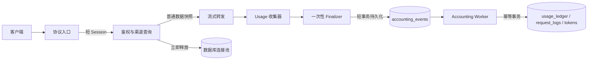

# Rotor 流式请求与异步记账设计

- 状态：提案
- 日期：2026-07-14
- 适用范围：OpenAI Chat Completions、OpenAI Responses、Anthropic Messages
- 目标版本：分阶段实施

## 1. 背景

Rotor 当前使用 FastAPI 的 `yield` 依赖提供请求级 `AsyncSession`。对于普通 JSON
响应，这个生命周期通常很短；对于 `StreamingResponse`，依赖清理会延迟到响应体结束。
如果流式请求在生成期间持有已执行过查询的 Session，它通常也会持续占用数据库连接。

SQLAlchemy 默认 `QueuePool` 的常见容量为：

```text
pool_size=5 + max_overflow=10 = 最多 15 个并发连接
```

因此，15 个长时间流式请求就可能占满连接池，第 16 个请求等待 `pool_timeout`
后出现：

```text
sqlalchemy.exc.TimeoutError: QueuePool limit ... connection timed out
```

当前的止血修复是在返回流式响应前关闭请求 Session，并在流结束时通过新 Session
写入记账数据。该方案能够解除连接池占用，但业务代码仍直接管理依赖 Session，记账也仍在
流生成器内同步完成。本设计给出长期架构，使流式传输与数据库生命周期彻底解耦。

## 2. 设计目标

1. 模型流式传输期间不持有数据库连接。
2. 流式业务代码不跨 Session 传递 SQLAlchemy ORM 实例。
3. 成功、失败和客户端断连都只产生一个最终记账事件。
4. 重试、进程重启和多 worker 消费不会重复计费。
5. Token 计数通过原子 SQL 更新，避免并发写覆盖。
6. 记账失败不阻塞已开始的模型输出，并且不能静默丢失。
7. 队列积压、连接池使用和记账延迟均可监控。
8. 支持渐进迁移，不要求一次性重写所有协议入口。

## 3. 非目标

- 本设计不解决流已经向客户端发送后切换上游渠道的问题。
- 本设计不把扩大数据库连接池作为主要解决方案。
- 第一阶段不保证跨机房消息队列级别的高可用。
- 本设计不改变各上游返回 usage 的准确性；缺失 usage 仍应标记为 `missing`。

## 4. 总体架构



请求分为三个明确阶段：

1. **准备阶段**：短 Session 完成鉴权、渠道查询和路由所需数据读取，然后关闭 Session。
2. **传输阶段**：只使用不可变数据快照、HTTP 客户端和 usage 收集器，不访问数据库。
3. **结算阶段**：生成一个最终事件，通过短事务写入持久化事件表，由后台 worker 结算。

这里的“流式路径不占数据库连接”指生成和向客户端发送数据的长耗时阶段不占连接；准备和
最终事件持久化允许使用毫秒级短事务。

## 5. 核心组件

### 5.1 请求数据快照

禁止将 `Token`、`Channel` ORM 实例传入流生成器。准备阶段将必要字段复制到普通、不可变
的数据类中：

```python
@dataclass(frozen=True, slots=True)
class TokenSnapshot:
    id: int
    user_id: str | None
    quota: int | None


@dataclass(frozen=True, slots=True)
class ChannelSnapshot:
    id: int
    name: str
    type: str
    protocol: str
    base_url: str
    key: str
    model_mapping: dict[str, str]
    extra: dict
```

快照只携带本次请求需要的字段。密钥不得写入日志、记账事件或会话归档；适配器使用完渠道
快照后，不应把完整快照附加到异常对象。

建议新增服务边界：

```text
RequestContextService.prepare(...)
    -> PreparedRequest(token, candidates, routing_context)
```

`prepare()` 内部自行使用 `async_session_maker()`，协议入口不再注入一个贯穿整个请求的
`db: AsyncSession`。

### 5.2 Usage 收集器

每个流持有一个纯内存 `UsageAccumulator`，负责收集：

- prompt、completion、cached、reasoning、audio token；
- 是否收到上游 usage；
- 最终状态和错误摘要；
- 开始时间、首 token 时间、结束时间；
- 上游实际模型和最终渠道。

它不依赖数据库，也不修改 Token 对象。没有收到上游 usage 时，必须输出
`usage_source="missing"`，不能把估算值伪装成上游精确值。

### 5.3 一次性 Finalizer

所有结束路径统一调用 `AccountingFinalizer.finalize_once()`：

- 正常完成：`status=success`；
- 上游失败：`status=failed`；
- 客户端断开或任务取消：`status=cancelled`；
- 内部超时：`status=timeout`。

Finalizer 在进程内通过锁或原子状态保证只执行一次，数据库层再通过唯一键提供最终幂等。
不要分别在多层 `except` 中直接写账，否则异常传播时容易产生一条成功账和一条失败账。

取消处理需要显式覆盖 `asyncio.CancelledError`。最终事件持久化应使用有界超时的
`asyncio.shield()`，确保客户端断开不会立即取消结算；达到超时后写入本地应急 spool，并
重新传播取消信号。

### 5.4 持久化事件表

计费事件不能复用当前 `ConversationStore` 的有界、满载可丢弃队列。会话归档可以降级，
计费和额度扣减不能静默丢失。

建议新增 `accounting_events`：

| 字段 | 说明 |
|---|---|
| `id` | 事件主键，UUID/ULID |
| `idempotency_key` | 最终事件唯一键，建议等于规范化 `request_id` |
| `request_id` | 外部或 Rotor 生成的请求 ID |
| `conversation_id` | 可空，会话 ID |
| `token_id` / `user_id` | 计费主体 |
| `channel_id` | 最终使用渠道 |
| `request_protocol` / `provider_protocol` | 请求与上游协议 |
| `model` / `provider_model` | 模型信息 |
| usage 各字段 | token 明细和 `usage_source` |
| `status` | success、failed、cancelled、timeout |
| `error_code` / `error_message` | 截断且脱敏的错误摘要 |
| `latency_ms` / `first_token_ms` | 延迟指标 |
| `state` | pending、processing、done、dead |
| `attempts` / `available_at` | 重试控制 |
| `created_at` / `processed_at` | 审计时间 |

约束与索引：

```text
UNIQUE(idempotency_key)
INDEX(state, available_at)
INDEX(request_id)
INDEX(created_at)
```

事件 payload 应使用明确列或带版本号的 JSON schema。若使用 JSON，至少包含
`schema_version=1`，确保后续 worker 可以兼容旧事件。

### 5.5 Accounting Worker

worker 在应用 lifespan 启动，职责是：

1. 批量领取 `pending` 且已到 `available_at` 的事件；
2. 每个事件在一个短事务内完成 ledger、request log 和 Token 计数更新；
3. 成功后标记 `done`；
4. 可重试错误按指数退避重新设为 `pending`；
5. 超过最大次数标记 `dead` 并报警，不删除原事件。

PostgreSQL 多 worker 可使用 `SELECT ... FOR UPDATE SKIP LOCKED`。SQLite 不支持相同的并发
领取能力，第一阶段只运行一个 accounting worker，并用条件更新实现领取；部署切换到
PostgreSQL 后再启用多消费者。

应用关闭时停止接收新任务，等待 worker 在配置的宽限期内处理已有事件，然后退出。未处理
事件保留在数据库中，下次启动继续消费。

未来若引入 Redis Streams、RabbitMQ 或 Kafka，`AccountingEventPublisher` 接口可以替换
实现，协议入口和结算逻辑不需要变化。

## 6. 一致性和幂等

### 6.1 最终事件唯一

`request_id` 必须在进入系统时规范化：缺失时由 Rotor 生成；客户端传入过长或非法值时
拒绝或哈希，不直接突破数据库列限制。

同一请求的最终结算只允许一个事件。重复发布时：

- payload 相同：返回已存在事件，视为成功；
- payload 冲突：保留首个事件并记录高优先级告警，禁止二次扣费。

### 6.2 消费事务

worker 的单事件事务遵循以下顺序：

1. 向 `usage_ledger` 插入记录，`idempotency_key` 唯一；
2. 只有本事务确实插入新 ledger 时，才写 `request_logs` 并更新 Token 计数；
3. 将事件标记为 `done`；
4. 一次提交。

如果 ledger 已存在，worker 只把事件标记为 `done`，不得再次更新计数。

现有 `usage_ledger.request_id` 只有普通索引。迁移前需要扫描和处理重复记录，然后增加唯一的
`idempotency_key` 列；不能直接假设历史 `request_id` 全部唯一。

### 6.3 Token 原子更新

禁止“读取 ORM 数值、Python 加法、再保存”的方式。并发请求会读取相同旧值并发生丢失更新。
应执行原子 SQL：

```sql
UPDATE tokens
SET request_count = request_count + 1,
    token_count   = token_count + :total_tokens,
    used_quota    = used_quota + :total_tokens,
    last_used_at  = :now,
    enabled       = CASE
        WHEN quota IS NOT NULL
         AND used_quota + :total_tokens >= quota THEN FALSE
        ELSE enabled
    END
WHERE id = :token_id;
```

该更新必须与 ledger 插入处于同一事务中。

### 6.4 Quota 语义

异步结算意味着额度更新是最终一致的。在突发并发下，多个请求可能同时通过入口额度检查，
最终用量会超过 quota。需要明确产品语义：

- **软额度（第一阶段推荐）**：允许有限超额，worker 最终禁用 Token；实现简单、吞吐高。
- **严格额度**：准备阶段短事务原子预留本次最大 token 预算，结束后按实际 usage 结算并退回
  差额。预留记录同样必须幂等，并设置超时回收机制。

在实现预留机制前，管理界面和 API 文档应将 quota 描述为软限制。

## 7. 数据库 Session 边界

建议只保留以下 Session 使用点：

| 阶段 | Session 生命周期 | 是否跨 `yield` |
|---|---:|---:|
| 鉴权、渠道查询、路由准备 | 单个短只读事务 | 否 |
| 流式 HTTP 传输 | 无 Session | 否 |
| 最终事件持久化 | 单个短写事务 | 否 |
| worker 消费 | 每批领取 + 每事件短事务 | 否 |
| 管理 API | 请求级短事务 | 否 |

规则：

- Session 不存入 `Request.state`、全局变量、生成器闭包或队列事件。
- ORM 实例不跨 Session 边界；跨边界只传快照和主键。
- 事务中不执行上游 HTTP、文件 I/O、SSE `yield` 或阻塞等待。
- `get_db()` 不再用于流式协议入口的整个函数生命周期。

## 8. 连接池配置

解除长连接占用后，连接池仍需提供保护和可观测性。建议新增配置：

```text
DB_POOL_SIZE=5
DB_MAX_OVERFLOW=10
DB_POOL_TIMEOUT=10
DB_POOL_RECYCLE=1800
DB_POOL_PRE_PING=true
```

这些值需要根据数据库容量、Uvicorn worker 数和 accounting worker 数计算。总连接上限近似为：

```text
进程数 × (pool_size + max_overflow)
```

`pool_pre_ping` 用于发现失效连接，`pool_recycle` 用于规避服务端空闲连接回收。增大池只能吸收
短时突发，不能容忍流式请求长期占用连接。

SQLite 部署应保持较小写并发；生产高并发建议使用 PostgreSQL。

## 9. 背压、失败与恢复

### 9.1 发布失败

最终事件写数据库失败时：

1. 在较短上限内重试，例如 3 次指数退避；
2. 仍失败则写入只追加的本地 spool 文件；
3. 记录高优先级日志和指标；
4. 后台恢复任务重放 spool；
5. 不因为记账失败修改已经发送给客户端的模型内容。

spool 每行包含带校验和的版本化 JSON 事件，写入后执行 flush；如要求进程崩溃级可靠性，
再启用 `fsync`。spool 不得包含渠道密钥或完整提示词。

### 9.2 消费失败

- 数据库死锁、临时断连：指数退避并添加随机抖动；
- schema 或数据错误：进入 `dead`，避免无限热循环；
- Token 已删除：ledger 仍保留，Token 更新记为不可恢复异常并告警；
- 重复事件：幂等跳过，不报警；payload 冲突才报警。

### 9.3 队列积压

持久化事件表是事实来源，进程内通知队列只用于唤醒 worker。通知队列满时可以丢通知，因为
worker 还会定时扫描 `pending` 事件；绝不能丢持久化事件本身。

## 10. 可观测性

至少暴露以下指标：

```text
rotor_db_pool_checked_out
rotor_db_pool_overflow
rotor_db_pool_checkout_seconds
rotor_db_pool_timeout_total
rotor_accounting_events_pending
rotor_accounting_events_dead
rotor_accounting_publish_failures_total
rotor_accounting_processing_seconds
rotor_accounting_event_lag_seconds
rotor_accounting_duplicates_total
rotor_streams_active
rotor_streams_cancelled_total
```

建议告警：

- 连接池使用率持续超过 80%；
- 任意连接池 timeout；
- 最老 pending 事件超过 60 秒；
- 出现 dead 事件或本地 spool 文件；
- ledger 与 Token 聚合计数对账不一致。

日志统一携带 `request_id`、`accounting_event_id`、`token_id` 和 `channel_id`，禁止记录 API key、
Authorization header 和完整请求/响应正文。

## 11. 安全与数据保留

- `error_message` 入库前统一脱敏并限制为 500 字符。
- IP 地址按现有隐私策略存储；如无业务必要，考虑哈希或截断。
- accounting event 处理完成后保留一段可审计期限，再归档或删除。
- ledger 作为账本应追加写，修正通过反向/调整记录表达，不直接覆盖历史事实。
- 管理接口查询 dead 事件和重放操作必须要求管理员权限并记录审计日志。

## 12. 分阶段迁移计划

### 阶段 0：已完成的止血修复

- 流开始前关闭请求 Session；
- 流结束后使用独立短 Session 记账；
- 验证连接池不再与活跃流数量线性占用。

### 阶段 1：Session 与 ORM 解耦

- 新增 `TokenSnapshot`、`ChannelSnapshot` 和 `PreparedRequest`；
- 新增 `RequestContextService.prepare()`；
- Chat、Responses、Anthropic 入口不再把 ORM 实例和 Session 放入生成器；
- 引入统一 `UsageAccumulator` 和 `finalize_once()`；
- 保持现有同步短事务记账，控制改动范围。

### 阶段 2：持久化异步记账

- 新增 `accounting_events` 表和 Alembic 迁移；
- 为 `usage_ledger` 增加幂等键；
- 实现 publisher、worker、重试、dead 状态和 lifespan 管理；
- 协议入口改为只发布最终事件；
- 增加优雅关闭和进程重启恢复测试。

### 阶段 3：原子额度与可靠性

- Token 计数改为原子 SQL；
- 增加本地 spool 与恢复任务；
- 完成历史 ledger 对账工具；
- 根据产品要求选择软额度或严格预留额度。

### 阶段 4：生产扩展

- PostgreSQL 下启用多 worker `SKIP LOCKED` 消费；
- 接入指标系统和告警；
- 需要跨主机高吞吐时替换为外部消息队列。

每个阶段都可独立发布。阶段 1 或 2 出现问题时，可以回退到当前“流结束后短 Session 记账”
方案，不回退最初的长 Session 行为。

## 13. 测试方案

### 13.1 单元测试

- 快照不包含 ORM 状态和渠道密钥之外的非必要字段；
- usage 完整、缺失、乱序和重复 chunk；
- success、failed、cancelled、timeout 均只 finalize 一次；
- 同一幂等键重复消费不会重复更新 Token；
- 并发原子更新不会丢失计数；
- 重试退避和 dead 状态转换正确。

### 13.2 集成测试

- 使用 `pool_size=2, max_overflow=0` 启动 50 个长流，管理 API 和新请求仍能获取连接；
- 流传输期间断言 `checked_out` 不随活跃流数量增长；
- worker 停止时事件持续进入 pending，恢复后全部处理；
- 在 ledger 插入、Token 更新和事件完成标记的不同位置注入故障，事务回滚后可安全重试；
- 模拟客户端中途断开，生成且只生成一条 cancelled 事件；
- 进程在事件发布后、消费前退出，重启后账本完整；
- SQLite 单 worker和 PostgreSQL 多 worker 分别验证。

### 13.3 对账测试

对任意 Token，应满足：

```text
tokens.token_count
  = SUM(usage_ledger.total_tokens WHERE status = 'success' AND token_id = ?)
```

如果后续引入调整账，等式应包含 adjustment ledger。每日运行对账任务，发现差异时只报警和生成
修复建议，不自动覆盖账本。

## 14. 验收标准

长期方案完成需同时满足：

1. 100 个持续 2 分钟的并发流不会导致连接池 timeout。
2. 活跃流从 1 增加到 100 时，数据库 checked-out 连接只出现短暂尖峰，不持续增长。
3. 成功、失败、取消请求在最终一致窗口内均有且只有一条 ledger。
4. 重复投递 100 次只扣减一次额度。
5. worker 中断并重启后，所有 pending 事件最终变为 done 或可告警的 dead。
6. 100 个并发结算后的 Token 聚合计数与 ledger 求和完全一致。
7. 数据库不可用期间不丢事件，恢复后 spool/pending 可全部重放。
8. 日志和事件数据中不包含 API key、Authorization header 或完整提示词。

## 15. 建议的代码布局

```text
src/rotor/
├── gateway/
│   ├── request_context.py       # 准备阶段和数据快照
│   └── usage.py                 # UsageAccumulator
├── accounting/
│   ├── events.py                # AccountingEvent schema
│   ├── publisher.py             # 持久化发布与 spool fallback
│   ├── finalizer.py             # finalize_once 与取消处理
│   ├── worker.py                # 消费、重试和 dead 状态
│   └── repository.py            # 幂等事务和原子 Token 更新
├── models/
│   └── accounting_event.py
└── api/v1/
    ├── chat.py
    ├── responses.py
    └── anthropic.py
```

现有 `gateway/accounting.py` 可在阶段 1 保留为兼容层；阶段 2 后逐步把数据库写入职责迁移到
`accounting/repository.py`，协议模块只负责收集结果和发布事件。

## 16. 设计决策摘要

| 决策 | 选择 | 原因 |
|---|---|---|
| 流式期间数据库使用 | 不使用 | 从根本上解除连接池与流时长的耦合 |
| 跨阶段数据 | 不可变快照 | 避免 detached ORM 和隐式查询 |
| 记账队列 | 持久化事件表 | 进程崩溃后可恢复，不能静默丢账 |
| 消费保证 | 至少一次 + 幂等 | 比追求不可证明的“恰好一次”更可实现 |
| Token 更新 | 原子 SQL | 避免并发丢失更新 |
| SQLite 消费者 | 单 worker | 降低写锁竞争 |
| Quota 初期语义 | 软限制 | 与异步结算匹配，严格限制另做预算预留 |
| 外部消息队列 | 延后、接口预留 | 当前规模先控制运维复杂度 |

